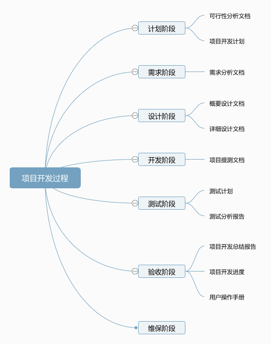

# 软件工程常用文档

软件工程常用文档模板及示例：项目计划、需求分析、概要设计、详细设计、用户操作手册、测试计划、测试分析报告、开发进度报告、项目开发总结报告、软件维护手册等

## 目录

### 01 计划阶段

- 00 可行性分析
- 01 项目信息表
- 02 项目实施方案-PPT版
- 03 项目实施方案-Word版
- 04 项目实施进度计划
- 05 项目实施进度简表

### 02 需求阶段

- 需求规格说明书

### 03 设计阶段

- 功能设计说明书
- 数据库设计说明书

### 04 开发阶段

- 系统提测申请单

### 05 测试阶段

- 01 测试用例
- 02 测试报告
- 03 测试计划

### 06 验收阶段

- 01 系统竣工报告
- 02 安装维护手册
- 03 培训文档
- 04 使用手册

### 999 其他文档

- 工时统计表
- 会议纪要
- 项目进度简报
- 项目进度确认单
- 项目月报
- 项目周报
- 完善中 ...

 ----

## 各文档目的

### 可行性分析报告

说明该软件开发项目的实现在技术上、经济上和社会因素上的可行性，评述为了合理地达到开发目标可供选择的各种可能实施方案，说明并论证所选定实施方案的理由。

### 项目开发计划

为软件项目实施方案制订出具体计划，应该包括各部分工作的负责人员、开发的进度、开发经费的预算、所需的硬件及软件资源等。

### 项目需求分析文档

对所开发软件的功能、性能、用户界面及运行环境等作出详细的说明。它是在用户与开发人员双方对软件需求取得共同理解并达成协议的条件下编写的，也是实施开发工作的基础。该说明书应给出数据逻辑和数据采集的各项要求，为生成和维护系统数据文件做好准备。

### 项目概要设计文档

该说明书是概要实际阶段的工作成果，它应说明功能分配、模块划分、程序的总体结构、输入输出以及接口设计、运行设计、数据结构设计和出错处理设计等，为详细设计提供基础。

### 项目详细设计文档

着重描述每一模块是怎样实现的，包括实现算法、逻辑流程等。

### 用户操作手册

本手册详细描述软件的功能、性能和用户界面，使用户对如何使用该软件得到具体的了解,为操作人员提供该软件各种运行情况的有关知识，特别是操作方法的具体细节。

### 测试计划

为做好集成测试和验收测试，需为如何组织测试制订实施计划。计划应包括测试的内容、进度、条件、人员、测试用例的选取原则、测试结果允许的偏差范围等。

### 测试分析报告

测试工作完成以后，应提交测试计划执行情况的说明，对测试结果加以分析，并提出测试的结论意见。

### 项目开发进度报告

该月报系软件人员按月向管理部门提交的项目进展情况报告，报告应包括进度计划与实际执行情况的比较、阶段成果、遇到的问题和解决的办法以及下个月的打算等。

### 项目开发总结报告

软件项目开发完成以后，应与项目实施计划对照，总结实际执行的情况，如进度、成果、资源利用、成本和投入的人力，此外，还需对开发工作做出评价，总结出经验和教训。

### 软件维护手册

主要包括软件系统说明、程序模块说明、操作环境、支持软件的说明、维护过程的说明，便于软件的维护。

----

## TODO List

  清单 | 进度
  --- | ---
  **01 计划阶段** | ✅
  **02 需求阶段** | ✅
  **03 设计阶段** | ✅
  **04 开发阶段** | ✅
  **05 测试阶段** | ✅
  **06 验收阶段** | ✅
  **07 其他文档** | ❌

----
